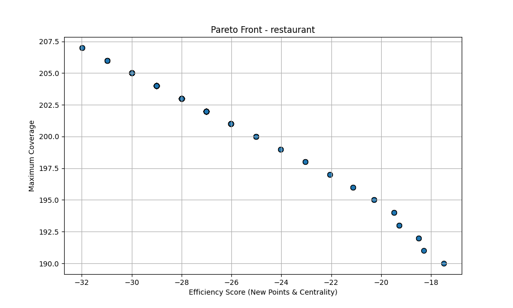
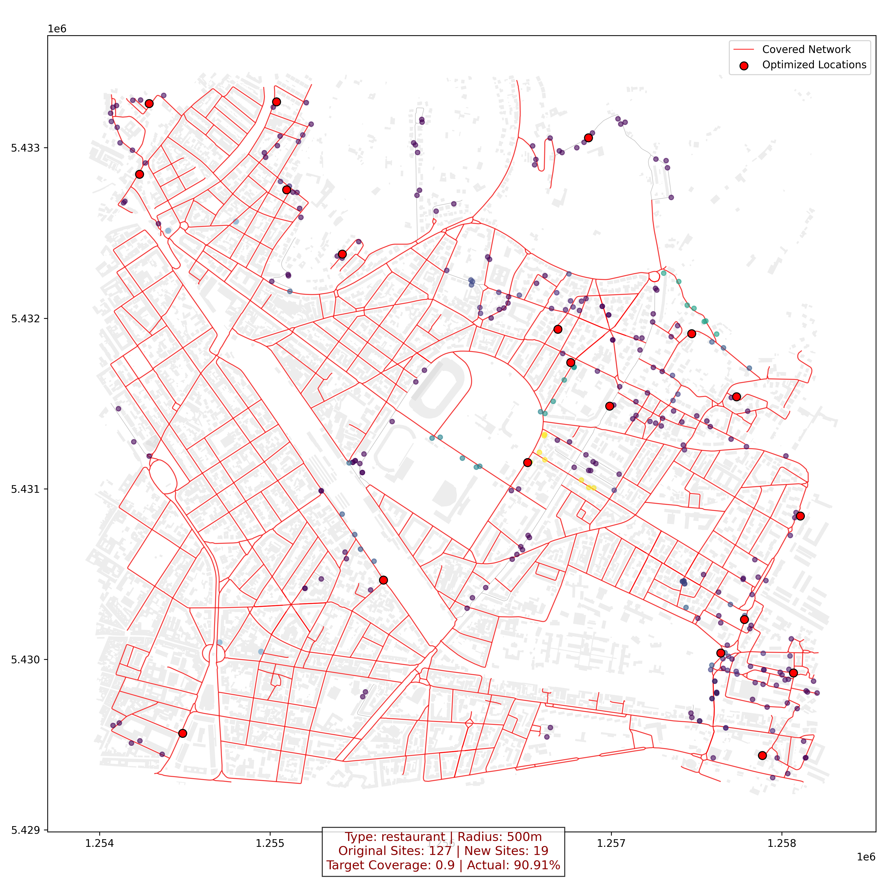

# 🚀 Urban-Optima: 基于多目标优化算法的空间选址决策引擎

> **项目标签**：策略算法 / 城市计算 / 自动化规划工具 / 运筹优化

### 🌟 项目定位 (Product Vision)
**Urban-Optima** 是一款面向城市规划者和商业选址分析师的自动化决策辅助工具。它通过结合路网拓扑分析与 **NSGA-II 多目标优化算法**，能够在复杂城市环境下，针对不同类型的服务设施（如餐厅、商店、学校等），自动识别服务盲区并生成平衡了“覆盖效率”与“建设成本”的最优选址方案。

---

### 📉 解决的业务痛点 (Pain Points)
在传统的城市设施规划中，通常面临以下挑战：
* **人工经验依赖**：传统选址依赖人工在地图上标注，难以在复杂路网中准确识别服务死角。
* **多目标冲突**：设施覆盖率越高往往意味着成本越高，如何在有限的资源（新增点位数）下实现最大的覆盖增益？
* **真实距离误差**：传统的“直线距离”忽略了路网实际通行情况，导致选址偏离实际需求。

---

### 🛠️ 产品核心逻辑 (Product Logic)

本项目将复杂的选址逻辑抽象为四个标准化模块：

| 模块名称 | 逻辑描述 | 核心输出 |
| :--- | :--- | :--- |
| **路网感知层** | 构建基于真实几何拓扑的城市图网络，计算道路中心性。 | 空间权重矩阵 |
| **盲区挖掘层** | 基于不同设施的服务半径，识别不可达的“服务盲区”。 | 不可达区域 Polygon |
| **候选生成层** | 结合面积加权分配算法与空间随机采样，生成高质量候选点。 | 优化搜索空间 |
| **算法决策层** | 运行 NSGA-II 算法，在成本与覆盖率之间寻找帕累托最优解。 | 最优选址坐标 |

---

### 📊 核心能力与亮点 (Key Features)
* **异构数据融合**：整合 GeoJSON 路网与多品类 POI 数据。
* **多约束求解**：支持针对不同设施设定差异化搜索半径。
* **决策可视化**：自动导出优化前后的对比图谱及标准 GeoJSON 结果。

---

### 🚀 快速上手 (Quick Start)
1. 配置环境：`pip install -r requirements.txt`
2. 放入数据：路网放至 `data/raw/edges`，POI放至 `data/raw/`。
3. 运行引擎：`python main.py`

### 📊 决策支持可视化 (Decision Support Visualization)
本项目不仅输出地理数据，还提供多维度的可视化分析报告，辅助管理者进行直观决策：
- **路网韧性分析**：基于 Betweenness Centrality 识别城市骨干路段，确保选址具备高通达性。
- **算法收敛评估**：通过帕累托前沿 (Pareto Front) 图表，展示不同点位成本下的覆盖率收益曲线，支持业务灵活调整预算。
- **选址图谱绘制**：自动生成叠加建筑底图、路网覆盖范围和新增设施点的决策地图，实现规划方案的“即点即看”。

### 📊 成果演示 (Output Showcase)

#### 1. 算法效能分析：帕累托前沿图 (Pareto Front)
该图表展示了 **“新增设施成本（点位数量与中心性权重）”** 与 **“城市服务覆盖率”** 之间的帕累托最优关系。通过此图，产品经理可以直观地根据预算（点位数约束）选择最具性价比的方案。

  

*图中每一个点代表一个候选方案。左上角的方案代表用最少的点位实现了最大的覆盖率增长。*

#### 2. POI选址决策图(Decision map)
该图展示了在 500m 步行的约束下，算法自动识别的商业盲区及建议的新增点位。

  

